# How the create-t3-app CLI Works

This document explains the CLI from the top level down to its main components. It is based on the code in `cli/src`, especially the entrypoint, CLI parser, project creation helpers, installers, and templates.

## Big Picture

`create-t3-app` is a package in this monorepo. The root project uses pnpm and turbo to build and run packages. The actual CLI lives in `cli/`, is published as the `create-t3-app` npm package, and exposes `dist/index.js` as the executable.

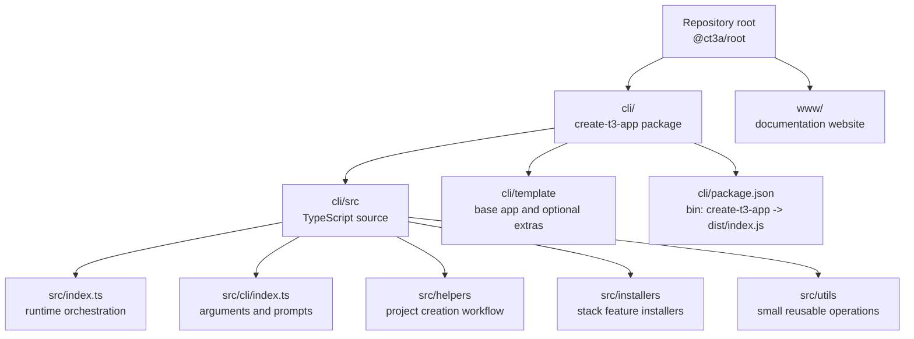

## Runtime Flow

When a user runs `npm create t3-app@latest`, `pnpm create t3-app@latest`, `yarn create t3-app`, or `bun create t3-app@latest`, the package manager invokes the CLI binary. In this repo, that binary is built from `cli/src/index.ts`.

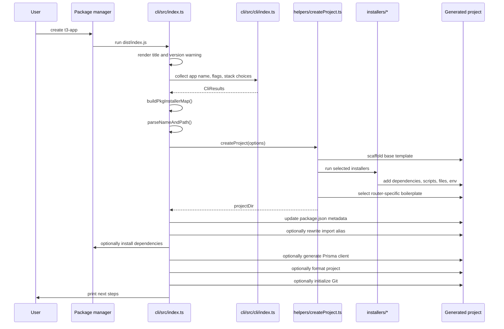

## Entry Point: `cli/src/index.ts`

The entrypoint is the conductor. It does not contain most of the feature-specific setup itself. Instead, it gathers input, builds the selected installer map, creates the project, and then performs post-generation tasks.

```mermaid
flowchart TD
  Start([main]) --> Version["get npm version<br/>get package manager"]
  Version --> UI["renderTitle()<br/>renderVersionWarning()"]
  UI --> Collect["runCli()"]
  Collect --> InstallerMap["buildPkgInstallerMap(packages, databaseProvider)"]
  InstallerMap --> NamePath["parseNameAndPath(appName)"]
  NamePath --> CreateProject["createProject(...)"]
  CreateProject --> PackageJson["write generated package.json name,<br/>ct3aMetadata.initVersion,<br/>packageManager"]
  PackageJson --> AliasDecision{"Custom import alias?"}
  AliasDecision -- yes --> Alias["setImportAlias(projectDir, alias)"]
  AliasDecision -- no --> InstallDecision
  Alias --> InstallDecision{"--noInstall?"}
  InstallDecision -- no --> InstallDeps["installDependencies()"]
  InstallDeps --> PrismaDecision{"Prisma selected?"}
  PrismaDecision -- yes --> PrismaGenerate["npx prisma generate"]
  PrismaDecision -- no --> Format
  PrismaGenerate --> Format["formatProject()"]
  InstallDecision -- yes --> GitDecision
  Format --> GitDecision{"--noGit?"}
  GitDecision -- no --> Git["initializeGit()"]
  GitDecision -- yes --> NextSteps
  Git --> NextSteps["logNextSteps()"]
  NextSteps --> Exit([process.exit(0)])
```

## CLI Input: `cli/src/cli/index.ts`

`runCli()` uses `commander` for arguments and flags, then uses `@clack/prompts` for interactive questions when needed.

There are three main modes:

1. CI mode with `--CI`, where prompts are skipped and package choices come from boolean flags.
2. Default mode with `-y` or `--default`, where the hardcoded default stack is used.
3. Interactive mode, where the user answers prompts.

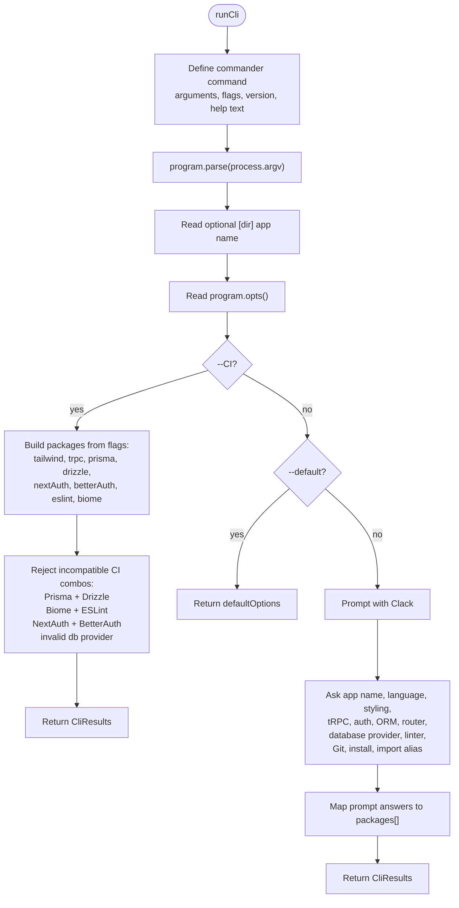

### Package Choices

The prompt answers are normalized into `AvailablePackages[]`. The installer layer later turns that list into a `PkgInstallerMap`.

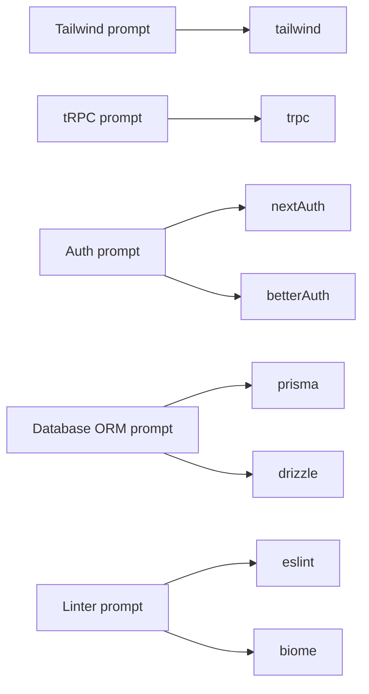

## Project Creation: `helpers/createProject.ts`

`createProject()` receives normalized options and writes the generated app. Its job is to combine the base template with selected extras.

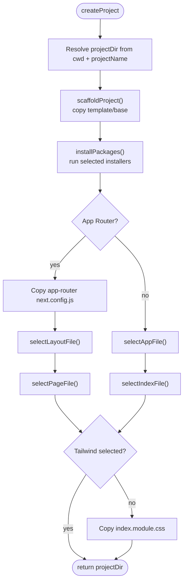

## Scaffolding: `helpers/scaffoldProject.ts`

The base scaffold is the minimum Next.js application from `cli/template/base`.

```mermaid
flowchart TD
  Scaffold([scaffoldProject]) --> Exists{"Target directory exists?"}
  Exists -- no --> Copy
  Exists -- yes --> Empty{"Directory empty?"}
  Empty -- yes --> Copy["Copy template/base to projectDir"]
  Empty -- no --> Prompt["Ask whether to abort, clear, or overwrite"]
  Prompt --> Abort{"Abort or cancel?"}
  Abort -- yes --> Stop([process.exit(1)])
  Abort -- no --> Clear{"Clear selected?"}
  Clear -- yes --> EmptyDir["fs.emptyDirSync(projectDir)"]
  Clear -- no --> Copy
  EmptyDir --> Copy
  Copy --> Gitignore["Rename _gitignore to .gitignore"]
  Gitignore --> Success([base app scaffolded])
```

## Installer Map: `installers/index.ts`

`buildPkgInstallerMap()` converts the selected package names into a stable map of all available installers. Each entry contains:

- `inUse`: whether this installer should run.
- `installer`: the function that modifies the generated project.

Some installers are always or conditionally enabled even if the user did not directly pick them:

- `envVariables` is always enabled.
- `dbContainer` is enabled for `mysql` and `postgres`.

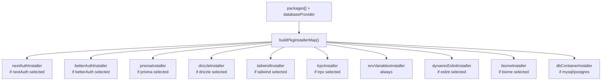

## Installing Selected Boilerplate: `helpers/installPackages.ts`

`installPackages()` loops over the installer map. For every entry where `inUse` is true, it runs that installer.

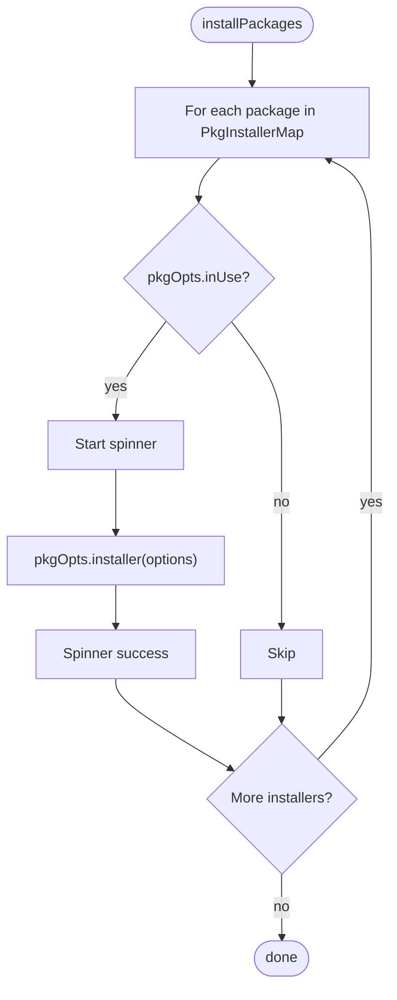

## What Installers Usually Do

Installers are small, focused functions. They usually combine three operations:

- Add dependencies to the generated `package.json`.
- Add scripts to the generated `package.json`.
- Copy or customize files from `cli/template/extras`.

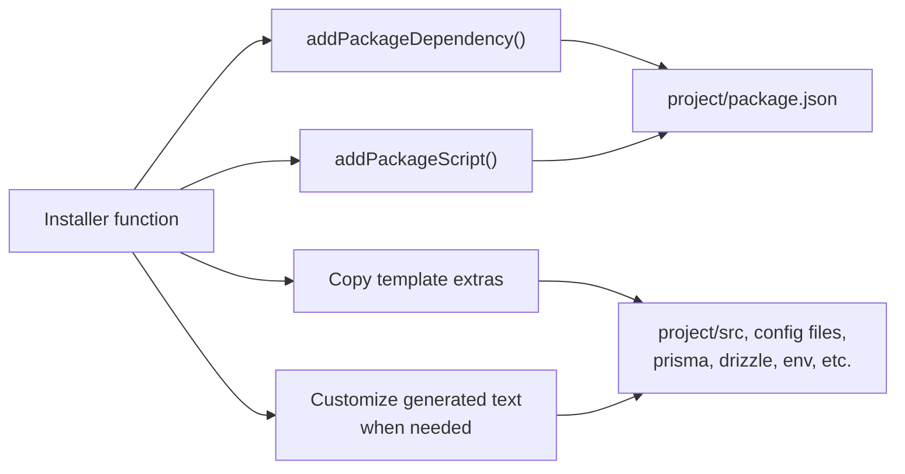

### Main Feature Installers

```mermaid
flowchart TD
  Tailwind["tailwindInstaller"] --> TailwindDeps["Adds tailwindcss, postcss,<br/>@tailwindcss/postcss"]
  Tailwind --> TailwindFiles["Copies postcss.config.js<br/>and globals.css"]

  TRPC["trpcInstaller"] --> TRPCDeps["Adds tRPC, React Query,<br/>superjson"]
  TRPC --> TRPCRouter{"App Router?"}
  TRPCRouter -- yes --> TRPCApp["Copies app route handler,<br/>server/client helpers,<br/>post component"]
  TRPCRouter -- no --> TRPCPages["Copies pages API handler<br/>and utils/api.ts"]
  TRPC --> TRPCContext["Chooses trpc.ts and post router<br/>based on auth + database"]

  Prisma["prismaInstaller"] --> PrismaDeps["Adds prisma and @prisma/client"]
  Prisma --> PrismaSchema["Chooses schema template<br/>based on auth + provider"]
  Prisma --> PrismaScripts["Adds db scripts and postinstall"]
  Prisma --> PrismaClient["Copies Prisma db client"]

  Drizzle["drizzleInstaller"] --> DrizzleDeps["Adds drizzle-kit,<br/>drizzle-orm, provider driver"]
  Drizzle --> DrizzleConfig["Copies and customizes drizzle.config.ts"]
  Drizzle --> DrizzleSchema["Chooses schema template<br/>based on auth + provider"]
  Drizzle --> DrizzleScripts["Adds db scripts"]

  Auth["nextAuthInstaller / betterAuthInstaller"] --> AuthDeps["Adds auth library and adapter deps"]
  Auth --> AuthFiles["Copies API route, config,<br/>server helpers"]

  Env["envVariablesInstaller"] --> EnvSchema["Chooses src/env.js template"]
  Env --> EnvFiles["Writes .env and .env.example"]
  Env --> Secret["Generates auth secret when needed"]
```

## Template Selection

The repo does not use one giant static template. It starts with `template/base`, then copies matching files from `template/extras` depending on the selected stack.

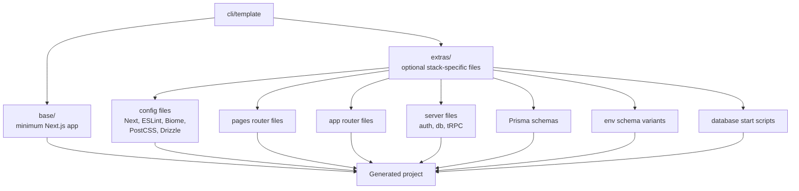

## Router-Specific Boilerplate

The CLI supports both Next.js App Router and Pages Router. After installers run, `createProject()` selects the correct top-level app files.

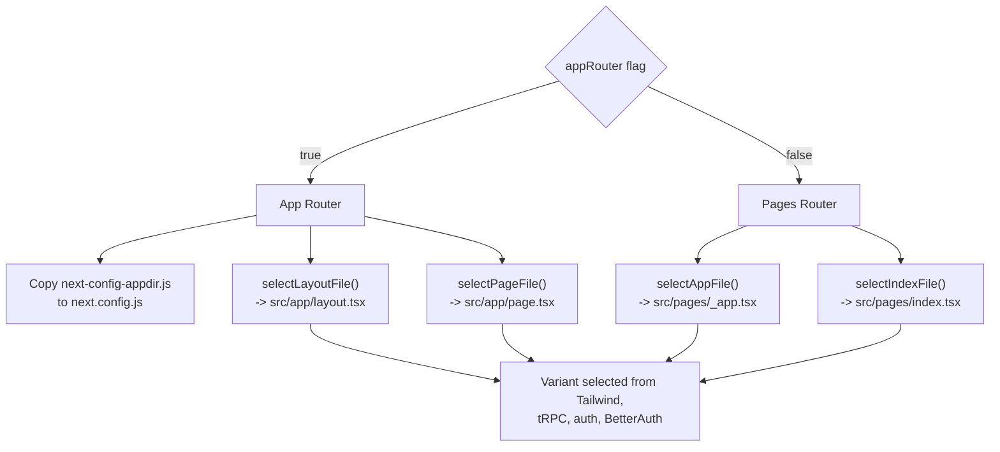

## Post-Creation Tasks

After `createProject()` returns, `cli/src/index.ts` finishes the project.

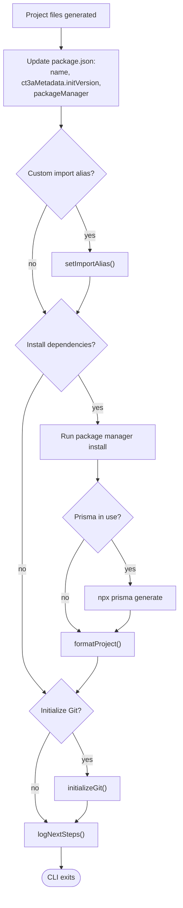

## Component Summary

| Component | Main files | Responsibility |
| --- | --- | --- |
| Package entry | `cli/package.json`, `cli/src/index.ts` | Defines the binary and orchestrates the whole CLI run. |
| CLI parser and prompts | `cli/src/cli/index.ts` | Reads command-line flags, handles CI/default/interactive modes, validates prompt input. |
| Project creation | `cli/src/helpers/createProject.ts` | Combines base scaffold, selected installers, and router-specific boilerplate. |
| Base scaffold | `cli/src/helpers/scaffoldProject.ts`, `cli/template/base` | Copies the minimum Next.js app into the target directory. |
| Boilerplate selection | `cli/src/helpers/selectBoilerplate.ts` | Chooses `_app`, `index`, `layout`, and `page` variants based on selected features. |
| Installer registry | `cli/src/installers/index.ts` | Defines available packages and builds the installer map. |
| Feature installers | `cli/src/installers/*.ts` | Add dependencies, scripts, config, source files, schemas, and env files. |
| Dependency installation | `cli/src/helpers/installDependencies.ts` | Runs the user's package manager install command. |
| Final setup | `cli/src/helpers/git.ts`, `format.ts`, `logNextSteps.ts`, `setImportAlias.ts` | Initializes Git, formats files, logs next steps, and updates import aliases. |
| Utilities | `cli/src/utils/*.ts` | Package manager detection, validation, package.json mutation, version lookup, logging, and name parsing. |

## Mental Model

The CLI can be understood as a layered generator:

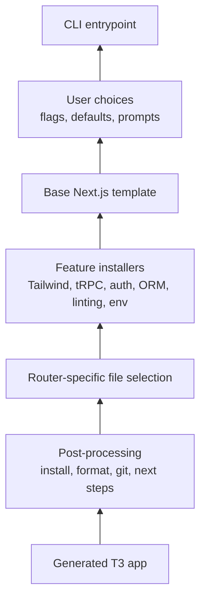

From bottom to top: the entrypoint gathers choices, the base template gives a working Next.js app, installers add the selected stack pieces, router selection chooses the correct app surface, and post-processing makes the generated project ready to use.
